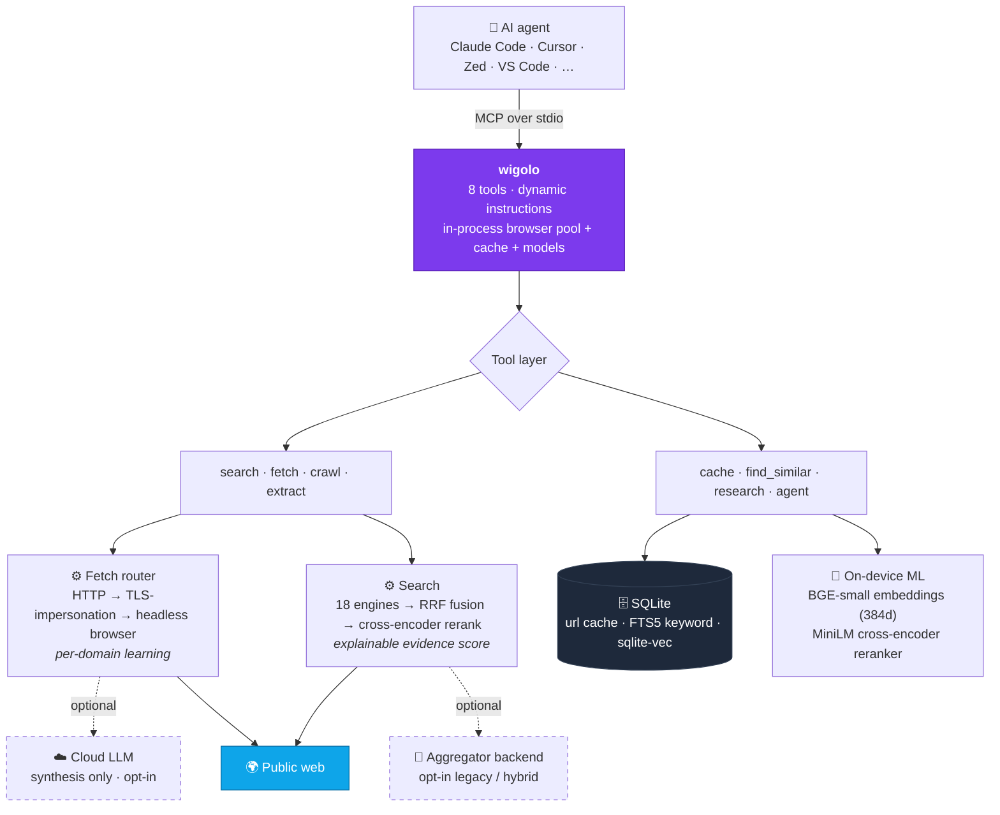

<div align="center">

<picture>
  <source media="(prefers-color-scheme: dark)" srcset="https://raw.githubusercontent.com/KnockOutEZ/wigolo/main/assets/brand/wigolo-wordmark-dark.png">
  
</picture>

### The go-to web for your agent

Local-first web intelligence over MCP — **no keys, no cloud, no metered bill.**

[](https://www.npmjs.com/package/wigolo)
[](https://nodejs.org)
[](https://modelcontextprotocol.io)
[](#license)

[Quickstart](#quickstart) · [Tools](#the-tools) · [Why wigolo](#why-its-different) · [Architecture](#architecture) · [Configuration](#configuration) · [Contribute](#contributing)

</div>

---

wigolo runs on your machine as an MCP server and gives an AI coding agent one durable surface for everything web-related — **search, fetch, crawl, extract, cache, find-similar, research,** and autonomous gather loops. The core tools need no API keys, nothing it touches leaves `~/.wigolo/`, and there's no bill that grows with how much your agent thinks.

```bash
npx wigolo init --agents=claude-code   # install components, wire into your agent
```

## See it

```console
$ wigolo shell
wigolo> search "postgres lateral join vs subquery" --category=docs

◆ 5 results · 18 engines → rank-fusion → rerank · 312 ms

[1] LATERAL — PostgreSQL Documentation                              0.94
    postgresql.org/docs/current/queries-table-expressions.html
    "A LATERAL item can reference columns of preceding FROM items; a
     plain subquery in the FROM list cannot — ideal for top-N-per-group."

[2] When a LATERAL join beats a correlated subquery                 0.88
    …/blog/lateral-joins
    "LATERAL runs the right side once per outer row, so the planner can
     push down LIMIT — a correlated subquery re-scans every time."

evidence for [1][2][4] · cached — the next call for this is 0 ms and free
```

Every result carries an explainable score and a citation id; the whole response lands in the local cache, so re-querying costs nothing. Ask for `format: "answer"` (with an optional LLM) and wigolo synthesizes a cited answer instead.

## Quickstart

You need **Node ≥ 20** and ~**1.5 GB** of free disk (headless browser, reranker, embedding model, and a cache that grows with use). macOS, Linux, and Windows all work.

```bash
npx wigolo init --agents=claude-code   # set up everything (idempotent — safe to re-run)
npx wigolo doctor                      # confirm it's healthy (no network)
```

Add it to any MCP client by hand:

```bash
claude mcp add wigolo -- npx wigolo
```

> **The LLM key is optional.** The core tools (search, fetch, crawl, extract, cache) work without one. Only `research`, `agent`, and `search format=answer` use an LLM to *synthesize* — point wigolo at a local model (Ollama) or a cloud provider and it's still fully functional either way.

<details>
<summary>Headless / CI setup (one command, no prompts)</summary>

```bash
WIGOLO_LLM_API_KEY=sk-... npx wigolo init --non-interactive \
  --agents=claude-code,cursor --provider=anthropic --search=core
```
The key is read from the env var, never passed as a CLI flag.
</details>

## The tools

| Tool | What it does |
|------|--------------|
| 🔎 `search` | Multi-engine web search (18 direct adapters) with rank fusion, ML cross-encoder reranking, and an explainable per-result score. Pass a query **array** for parallel breadth. |
| 📄 `fetch` | Load one URL through a tiered router (HTTP → TLS-impersonation → headless browser) that auto-escalates on anti-bot challenges or SPA shells. Clean markdown + metadata + links. |
| 🕸️ `crawl` | Multi-page crawl — BFS, DFS, sitemap, or map-only. Per-domain rate limits, robots.txt respect, boilerplate dedup. |
| 🧩 `extract` | Structured data from a page: tables, metadata, JSON-LD, brand identity, named schemas (Article / Recipe / Product / …), or any custom JSON Schema. |
| 💾 `cache` | Query everything already seen — keyword (BM25) or hybrid (BM25 + on-device vectors). Plus stats, clear, and change detection. |
| 🧲 `find_similar` | Pages similar to a URL or a concept, via 3-way fusion of keyword + semantic + live web. |
| 🧠 `research` | Decompose a question → fan out sub-queries → fetch sources → synthesize a cited report (or a structured brief the host LLM writes from). |
| 🤖 `agent` | Autonomous gather loop: plan → search → fetch → extract → synthesize, with a step log, time budget, and optional output schema. |

## Why it's different

- **$0 per query, free to re-query.** Default search talks to public engines through direct adapters; the reranker and embeddings run on-device. Every response is cached, so asking again is instant and costs nothing.
- **Private by default.** Cache, embeddings, models, and config live under `~/.wigolo/`. Nothing reaches a third party unless you explicitly opt into an LLM for synthesis.
- **Built for agents, not humans.** One MCP call fans out many queries across many engines in parallel — something a serial host tool-loop can't replicate — with transparent per-result scoring and budget-aware output.
- **Honest output.** Stale cache, failed fetches, degraded backends, and truncation are surfaced in the result, never disguised as empty-but-successful data.

It's **not** a hosted SaaS, a vector database other apps query, or a general web-automation framework. And it's honest about the trade: a hosted service will still beat it on **massive semantic discovery** over a global neural index, **crawling hostile sites at scale**, and **one-call finished answers** with zero local compute. wigolo is built for the local, private, low-cost lane — and to be as good as the paid services within it.

## Architecture

A single Node process speaking MCP (JSON-RPC over stdio). Everything heavy is local and lazy-loaded, so a zero-key install pays nothing for the parts it isn't using.



- **Code beats model.** Deterministic work — canonicalization, rank fusion, dedup, schema matching, hashing — never touches an LLM. The model is reserved for judgment, opt-in, and capped per request. LLM-filled fields are checked against the source and nulled if absent, so hallucinations don't reach your output.
- **Routing on observable signals.** The fetch ladder escalates to a real browser on what it *sees* — SPA markers, challenge bodies, thin content — not domain guesses. It learns per-domain and unlearns when a site stops needing it.
- **Transparent, honest results.** Every result carries a score breakdown and a query-understanding block; degraded state is always surfaced, never hidden.

## Configuration

A clean install works out of the box. A few settings meaningfully raise output quality — set them as environment variables or in your agent's MCP `env` block.

```bash
# 1. Synthesis — the biggest lever. Hosts like Claude Code don't expose MCP
#    sampling, so research/agent/answer need an LLM to write the final text.
export WIGOLO_LLM_PROVIDER=http://localhost:11434   # local (Ollama/vLLM/LM Studio) — free, on-device
export WIGOLO_LLM_PROVIDER=anthropic                # or cloud; key → OS keychain, never config.json

# 2. Wider retrieval funnel
export WIGOLO_SEARCH=hybrid                         # core engines + aggregator fallback
export WIGOLO_GITHUB_TOKEN=...                      # GitHub code search 10 → 30 req/min + org-private

# 3. Land more fetches, stay warm
export WIGOLO_TLS_TIER=auto                         # per-domain TLS-impersonation past Cloudflare/DataDome
export WIGOLO_EAGER_WARMUP=1                        # pay the ~1s model load up front, not on first search
```

For repeated interactive use, run `wigolo serve` so the browser pool, embeddings, and reranker stay resident across calls. To stay 100% on-device, a local LLM endpoint + `WIGOLO_TLS_TIER=auto` is the honest minimal set.

**Per-call habits that pay off:** query **arrays** (`["a","b","c"]`) for parallel breadth · `search_depth: "deep"` for queries that matter · `include_domains` as a hard filter for docs lookups.

<details>
<summary><b>CLI commands</b></summary>

| Command | What it does |
|---------|--------------|
| `wigolo` / `wigolo mcp` | Start the MCP stdio server (the default command). |
| `wigolo init` | Set up wigolo: install components, wire into detected agents. `--non-interactive --agents=<csv> --provider=<name> --search=<backend>` for CI. |
| `wigolo setup mcp` | Re-write just the MCP server entries, without the full wizard. |
| `wigolo doctor` | Cold-start health check — no network fetches. |
| `wigolo verify` | End-to-end smoke test (fetch, crawl, extract, search, rerank, embed). |
| `wigolo serve` | HTTP daemon — keeps subsystems warm across multiple clients. |
| `wigolo shell` | Interactive REPL (`--json` for piping). |
| `wigolo config` | Settings TUI; or headless `--set K=V`, `--export`, `--import`, `--cleanup`, `--uninstall --yes`. |
| `wigolo status` | Plain-text status summary. |
| `wigolo health` | Ping a running daemon's `/health`. |
| `wigolo backfill` | Embed cached pages that have no vector yet (`--batch-size`, `--dry-run`). |
| `wigolo plugin add\|list\|remove` | Manage custom extractor / search-engine plugins. |
| `wigolo uninstall` | Remove wigolo from agent configs (keeps your cache). |

</details>

<details>
<summary><b>Environment variables — search &amp; engines</b></summary>

| Var | Default | Effect |
|-----|---------|--------|
| `WIGOLO_SEARCH` | `core` | `core` (direct engines) / `searxng` (legacy) / `hybrid` (core + fallback). |
| `BRAVE_API_KEY` | — | When set, Brave joins the engine pool (env-only, never persisted). |
| `WIGOLO_GITHUB_TOKEN` | — | Lifts GitHub code search 10 → 30 req/min; enables org-private search (env-only). |
| `SEARXNG_URL` | — | External aggregator URL; when set, skips local bootstrap. |
| `SEARXNG_MODE` | `native` | `native` (Python venv) or `docker`. |
| `SEARXNG_PORT` | `8888` | Port for the native aggregator. |
| `SEARXNG_QUERY_TIMEOUT_MS` | `8000` | Per-query timeout to the aggregator. |
| `WIGOLO_MULTI_QUERY_CONCURRENCY` | `5` | Max parallel (query × engine) tasks. |
| `WIGOLO_MULTI_QUERY_MAX` | `10` | Max unique queries after normalization. |
| `WIGOLO_QUERY_EXPAND_VARIANTS` | `5` | Heuristic query-expansion variants. |

</details>

<details>
<summary><b>Environment variables — fetch, network &amp; TLS</b></summary>

| Var | Default | Effect |
|-----|---------|--------|
| `USER_AGENT` | rotating Chrome UAs | Override the User-Agent header. |
| `FETCH_TIMEOUT_MS` | `10000` | HTTP request timeout. |
| `FETCH_MAX_RETRIES` | `2` | Retry budget for 429 / 502 / 503 / network errors. |
| `MAX_REDIRECTS` | `5` | Manual-mode redirect cap. |
| `PLAYWRIGHT_LOAD_TIMEOUT_MS` | `15000` | Browser `page.load` wait. |
| `PLAYWRIGHT_NAV_TIMEOUT_MS` | `30000` | Browser navigation timeout. |
| `SEARCH_FETCH_TIMEOUT_MS` | `15000` | Per-result hydration fetch in search. |
| `SEARCH_TOTAL_TIMEOUT_MS` | `30000` | Aggregate search budget. |
| `USE_PROXY` / `PROXY_URL` | `false` / — | Route fetch through a proxy. |
| `WIGOLO_TLS_TIER` | `off` | `off` / `auto` (per-domain learned) / `on` (always try TLS first). |
| `WIGOLO_TLS_BROWSER` | `chrome_142` | TLS fingerprint profile (`<browser>_<version>`). |
| `WIGOLO_TLS_SUCCESS_THRESHOLD` | `3` | Successes before a domain flips to TLS-first. |

</details>

<details>
<summary><b>Environment variables — browser pool &amp; auth</b></summary>

| Var | Default | Effect |
|-----|---------|--------|
| `MAX_BROWSERS` | `3` | Max concurrent contexts per browser type. |
| `BROWSER_IDLE_TIMEOUT` | `60000` | Idle context eviction (ms). |
| `BROWSER_FALLBACK_THRESHOLD` | `3` | HTTP failures on a domain before forcing the browser. |
| `WIGOLO_BROWSER_TYPES` | auto (all 3) | CSV of browsers to use (chromium, firefox, webkit). |
| `WIGOLO_CDP_URL` | — | Chrome DevTools endpoint for a remote / logged-in browser. |
| `WIGOLO_AUTH_STATE_PATH` | — | Playwright `storageState.json` (cookies / localStorage). |
| `WIGOLO_CHROME_PROFILE_PATH` | — | Full Chrome `User Data` dir (copied to temp per use). |

</details>

<details>
<summary><b>Environment variables — cache &amp; crawl</b></summary>

| Var | Default | Effect |
|-----|---------|--------|
| `CACHE_TTL_SEARCH` | `86400` | Search result cache TTL (s). |
| `CACHE_TTL_CONTENT` | `604800` | Page content cache TTL (7 days). |
| `WIGOLO_FAST_STALE_MAX_HOURS` | `24` | In `cache` mode, accept entries up to this age. |
| `WIGOLO_FAST_TIMEOUT_MS` | `800` | Tight timeout for cache-mode fallback fetches. |
| `CRAWL_CONCURRENCY` | `2` | Per-public-domain concurrent fetches. |
| `CRAWL_DELAY_MS` | `500` | Per-public-domain inter-request delay. |
| `CRAWL_PRIVATE_CONCURRENCY` | `10` | Per-private-domain concurrency (localhost / RFC1918). |
| `CRAWL_PRIVATE_DELAY_MS` | `0` | Per-private-domain delay. |
| `RESPECT_ROBOTS_TXT` | `true` | When false, robots.txt is not fetched. |
| `VALIDATE_LINKS` | `true` | When false, broken-link probe is skipped. |
| `WIGOLO_CRAWL_INDEX` | — | `1` → crawled pages enqueued for embedding. |
| `WIGOLO_WAIT_FOR_INDEX` | — | `1` → embedding queue runs synchronously per page. |

</details>

<details>
<summary><b>Environment variables — reranker, embedding &amp; relevance</b></summary>

| Var | Default | Effect |
|-----|---------|--------|
| `WIGOLO_RERANKER` | `onnx` | `onnx` (cross-encoder) / `none` (consensus + authority + recency boosts only). |
| `WIGOLO_RERANKER_MODEL` | `Xenova/ms-marco-MiniLM-L-6-v2` | Cross-encoder model ID. |
| `WIGOLO_RERANKER_IDLE_TIMEOUT_MS` | `300000` | Hold the model warm 5 min after last use. |
| `WIGOLO_EMBEDDING_MODEL` | `BAAI/bge-small-en-v1.5` | Embedding model (384-dim). |
| `WIGOLO_EMBEDDING_IDLE_TIMEOUT` | `1800000` | Idle unload (30 min). |
| `WIGOLO_EMBEDDING_MAX_TEXT_LENGTH` | `8000` | Truncation before embedding. |
| `WIGOLO_RELEVANCE_THRESHOLD` | `0` | Min relevance for the agent's post-fetch filter. |
| `WIGOLO_FIND_SIMILAR_COLD_START_THRESHOLD` | `0.02` | Fused score below which `find_similar` emits `cold_start`. |

</details>

<details>
<summary><b>Environment variables — LLM integration (all optional)</b></summary>

| Var | Default | Effect |
|-----|---------|--------|
| `WIGOLO_LLM_PROVIDER` | — | `anthropic` / `openai` / `gemini` / `groq` / custom URL (Ollama, vLLM, LM Studio). |
| `WIGOLO_LLM_MODEL` | — | Universal model override. |
| `WIGOLO_LLM_MODEL_{ANTHROPIC\|OPENAI\|GEMINI\|GROQ}` | — | Per-provider model override (highest precedence). |
| `WIGOLO_LLM_MAX_CALLS_PER_REQUEST` | `1` | Hard ceiling on LLM calls per tool invocation. |
| `WIGOLO_LLM_CACHE_TTL_DAYS` | `7` | LLM response cache TTL. |
| `ANTHROPIC_API_KEY` / `OPENAI_API_KEY` | — | Read on every call; never persisted. |
| `GEMINI_API_KEY` / `GOOGLE_API_KEY` | — | Either name accepted. |
| `GROQ_API_KEY` | — | Same. |
| `WIGOLO_LLM_API_KEY` | — | Generic key for whichever provider `WIGOLO_LLM_PROVIDER` names. The provider-specific var wins; ignored during auto-detect. |

Keys can also live in the OS keychain or an AES-encrypted file (`wigolo init` / `wigolo config`) — never in `config.json`.

</details>

<details>
<summary><b>Environment variables — daemon, warmup, paths, logging &amp; misc</b></summary>

| Var | Default | Effect |
|-----|---------|--------|
| `WIGOLO_DATA_DIR` | `~/.wigolo` | Root for cache, models, keys, plugins, aggregator venv. |
| `WIGOLO_CONFIG_PATH` | `${DATA_DIR}/config.json` | Persisted config path. |
| `WIGOLO_DAEMON_PORT` | `3333` | Listen port for `wigolo serve`. |
| `WIGOLO_DAEMON_HOST` | `127.0.0.1` | Bind address. |
| `WIGOLO_EAGER_WARMUP` | — | `1` → pre-warm embed + rerank on startup (fire-and-forget). |
| `WIGOLO_BOOTSTRAP_MAX_ATTEMPTS` | `3` | Aggregator bootstrap retry limit. |
| `WIGOLO_HEALTH_PROBE_INTERVAL_MS` | `30000` | Background backend-health probe period. |
| `WIGOLO_PLUGINS_DIR` | `${DATA_DIR}/plugins` | Plugin discovery root. |
| `LOG_LEVEL` | `info` | `debug` / `info` / `warn` / `error`. |
| `LOG_FORMAT` | `json` | `json` or human-friendly `text`. |
| `WIGOLO_TELEMETRY` | — | `1` → local NDJSON event log (off by default, no PII). |
| `WIGOLO_TELEMETRY_ENDPOINT` | — | Also POST events fire-and-forget to this URL. |
| `WIGOLO_TUI_REDUCED_MOTION` | — | `1` → disable TUI spinners / animations. |

</details>

<details>
<summary><b>Common per-call options (tool arguments)</b></summary>

| Option | Tools | Notes |
|--------|-------|-------|
| `mode` | fetch, search, crawl, extract, find_similar | `cache` (fast, stale-OK) / `default` (smart routing) / `stealth` (full browser, no cache). |
| `search_depth` | search | `ultra-fast` (cache only) / `fast` / `balanced` (default) / `deep` (evidence + rerank highlights). |
| `query` | search | `string` or `string[]` — arrays fan out in parallel. |
| `include_domains` / `exclude_domains` | search, find_similar, research | Hard whitelist / blacklist (host-suffix match). |
| `format` | search | `answer` / `stream_answer` — triggers LLM synthesis with citations. |
| `citation_format` | search, crawl, research, agent | `numbered` / `json` / `anthropic_tags`. |
| `time_range` / `from_date` / `to_date` | search | Recency bounds. |
| `render_js` | fetch | `auto` / `always` / `never`. |
| `use_auth` | fetch, crawl | Route through configured auth (CDP > Chrome profile > storage state). |
| `actions` | fetch | Sequential browser actions (`click`, `type`, `wait`, `wait_for`, `scroll`, `screenshot`). |
| `section` | fetch | Extract a markdown subtree at a heading. |
| `strategy` | crawl | `bfs` / `dfs` / `sitemap` / `auto` / `map`. |
| `mode` (extract) | extract | `selector` / `tables` / `metadata` / `schema` / `structured` / `brand`. |
| `named_schema` | extract | `Article` / `Recipe` / `Product` / `CodeSnippet` / `Paper` / `EventListing`. |
| `depth` | research | `quick` / `standard` / `comprehensive`. |
| `max_pages` / `max_time_ms` | agent | Per-invocation page cap (default 3) and wall-clock budget. |
| `max_tokens_out` | most | Aggregate output-token budget (default 4000). |
| `include_full_markdown` | fetch, crawl, research, agent | `false` → evidence excerpts instead of full bodies. |

</details>

## Contributing

Bug reports, feature requests, and PRs are all welcome — see **[CONTRIBUTING.md](CONTRIBUTING.md)**. Keep tool handlers thin (business logic lives in the domain modules), add tests, and run the suite before opening a PR. wigolo also has a plugin system for custom extractors and search engines: `wigolo plugin add <git-url>`.

## License

**[GNU AGPL-3.0-only](LICENSE).** Free to use, modify, and self-host — including inside a company. The one obligation: if you run a **modified** version as a network service, you must publish your modified source under the same license. That keeps wigolo open while preventing a closed, hosted fork. See **[SECURITY.md](SECURITY.md)** to report a vulnerability and **[TRADEMARK.md](TRADEMARK.md)** for use of the name. For commercial-licensing questions, reach out.

<div align="center">
<br>

wigolo is free and meant to stay that way — maintained, not paywalled.
If it saves you a metered search bill, a ⭐, a sharp issue, or a **[☕ coffee](https://buymeacoffee.com/knockoutez)** helps keep it sustainable.

<sub>Built and maintained by <a href="https://github.com/KnockOutEZ">@KnockOutEZ</a> · <a href="mailto:ktowhid20@gmail.com">ktowhid20@gmail.com</a></sub>

</div>
