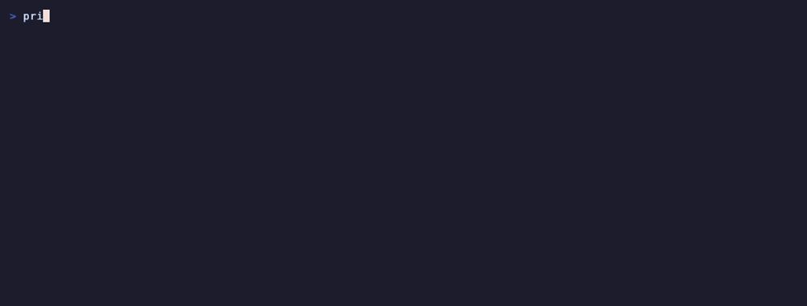

# wigolo examples

Runnable, self-contained examples for every way agents and scripts talk to
wigolo — the local-first web intelligence server. Each directory has its own
README with real captured output; terminal-flavored ones ship a rendered
`demo.gif` plus the `demo.tape` that produced it.

Works the same for coding agents (Claude Code, Cursor, Zed, ...) and
self-hosted automation (n8n-style platforms, cron jobs, plain shell).

| Example | What it shows |
|---|---|
| [quickstart-claude-code](./quickstart-claude-code/) | `npx wigolo init --agents=claude-code` — one command wires Claude Code, with a per-component setup report |
| [one-shot-cli](./one-shot-cli/) | every tool as a terminal command: `search`, `fetch`, `research`, and the `--json \| jq` contract |
| [shell-ndjson-pipeline](./shell-ndjson-pipeline/) | pipe commands into `wigolo shell --json` — one JSON doc per line, jq filters, exit codes you can gate on |
| [rest-curl](./rest-curl/) | `wigolo serve` + curl: `/health`, `/v1/tools`, `POST /v1/search`, `/openapi.json`, bearer-token mode |
| [sdk-typescript-research](./sdk-typescript-research/) | `wigolo-sdk` embedded local mode — spawn-or-reuse a daemon and run `research` in ~20 lines |
| [sdk-python-agent](./sdk-python-agent/) | the `wigolo` PyPI client — `local_client()` + the autonomous `agent` tool with a JSON Schema |
| [vercel-ai-sdk-tools](./vercel-ai-sdk-tools/) | wigolo as Vercel AI SDK tools — register `webSearch` / `webFetch` / `research` on any model |
| [n8n-remote-mcp](./n8n-remote-mcp/) | config reference: point self-hosted n8n (or any remote MCP/REST client) at `wigolo serve` |
| [watch-changelog-webhook](./watch-changelog-webhook/) | change-watch jobs on a changelog, on-demand checks, diff reports, webhook delivery |
| [plugin-search-engine](./plugin-search-engine/) | minimal `searchEngine` plugin — extend wigolo's engine set with your own source |

## Previews

**Set up Claude Code in one command** — [quickstart-claude-code](./quickstart-claude-code/):

**The one-shot CLI** — [one-shot-cli](./one-shot-cli/):

**NDJSON scripting** — [shell-ndjson-pipeline](./shell-ndjson-pipeline/):

## Conventions

- Scripts default to `npx wigolo`; set `WIGOLO="wigolo"` (or any entry point)
  to override.
- Examples that talk to a daemon use loopback ports in the 3477+ range and
  clean up after themselves.
- Everything runs keyless. Optional cloud or local language-model keys add
  answer synthesis and more schema-faithful extraction, and every example
  works without them.
